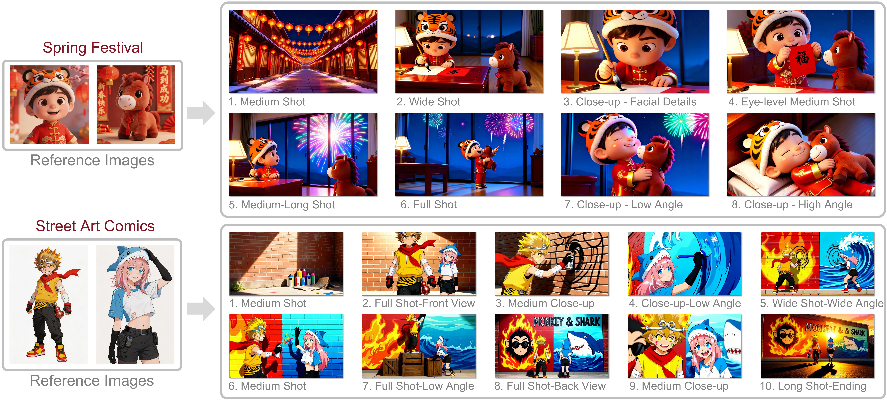

# [CVPR 2026 Highlight] DreamShot
Official implementation of **[DreamShot: Personalized Storyboard Synthesis with Video Diffusion Prior](https://ll3rd.github.io/DreamShot/)**

[](https://arxiv.org/abs/2604.17195) [](https://huggingface.co/datasets/LL3RD/DreamShot) [](https://huggingface.co/LL3RD/DreamShot) <br>



## 🚀 TODO
- [x] Release github repo.
- [x] Release inference code.
- [x] Release model checkpoints.
- [x] Release arXiv paper.
- [ ] Release the dataset (Because it involves movie data, it is currently under compliance review).
- [ ] Release training code (Release after the dataset is released).

## 📖 Introduction
Storyboard synthesis plays a crucial role in visual storytelling, aiming to generate coherent shot sequences that visually narrate cinematic events with consistent characters, scenes, and transitions. However, existing approaches are mostly adapted from text-to-image diffusion models, which struggle to maintain long-range temporal coherence, consistent character identities, and narrative flow across multiple shots. In this paper, we introduce DreamShot, a video generative model based storyboard framework that fully exploits powerful video diffusion priors for controllable multi-shot synthesis. DreamShot supports both Text-to-Shot and Reference-to-Shot generation, as well as story continuation conditioned on previous frames, enabling flexible and context-aware storyboard generation. By leveraging the spatial-temporal consistency inherent in video generative models, DreamShot produces visually and semantically coherent sequences with improved narrative fidelity and character continuity. Furthermore, DreamShot incorporates a multi-reference role conditioning module that accepts multiple character reference images and enforces identity alignment via a Role-Attention Consistency Loss, explicitly constraining attention between reference and generated roles. Extensive experiments demonstrate that DreamShot achieves superior scene coherence, role consistency, and generation efficiency compared to state-of-the-art text-to-image storyboard models, establishing a new direction toward controllable video model-driven visual storytelling.


## 🔧 Dependencies and Installation

```shell
git clone https://github.com/LL3RD/DreamShot-Code.git
cd DreamShot-Code
conda create -n DreamShot python=3.11
conda activate DreamShot
pip install torch==2.6.0 torchvision==0.21.0 torchaudio==2.6.0 --index-url https://download.pytorch.org/whl/cu124
pip install -e .
```

## ✍️ Inference
1. Download the model and vistorybench (test set) from [huggingface](https://huggingface.co/LL3RD/DreamShot):
```shell
hf download LL3RD/DreamShot --local-dir ./checkpoints
```

Our model is highly compatible with distilled LoRA, such as the 4-step LoRA trained with [LightX2V](https://github.com/ModelTC/lightx2v). During inference, we can combine step-based LoRA distillation to significantly speed up the process with almost no impact on performance.


2. Run inference on single GPU:
```shell
export DIFFSYNTH_MODEL_BASE_PATH=/opt/tiger/hub
python model_inference/inference_dreamshot.py \
    --model_path ./checkpoints/sft_lora_model.safetensors \
    --rl_model_path ./checkpoints/rl_lora_model.safetensors \
    --data_root ./checkpoints/VistoryBench \
    --output_dir ./outputs/vistory_bench \
    --vistory_json_path ./checkpoints/vistory_dreamshot_ch_v1.json \
    --lightx2v_model_path ./checkpoints/wan2.1_t2v_14b_lora_rank64_lightx2v_4step.safetensors 
```

3. For multi-GPU support:
```shell
export DIFFSYNTH_MODEL_BASE_PATH=/opt/tiger/hub
python model_inference/multi_gpu_inference.py \
    --model_path ./checkpoints/sft_lora_model.safetensors \
    --rl_model_path ./checkpoints/rl_lora_model.safetensors \
    --data_root ./checkpoints/VistoryBench \
    --output_dir ./outputs/vistory_bench \
    --vistory_json_path ./checkpoints/vistory_dreamshot_ch_v1.json \
    --lightx2v_model_path ./checkpoints/wan2.1_t2v_14b_lora_rank64_lightx2v_4step.safetensors 
```


## 📄 Citation
If you find this project useful for your research, please consider citing our [paper](https://arxiv.org/abs/2604.17195).


